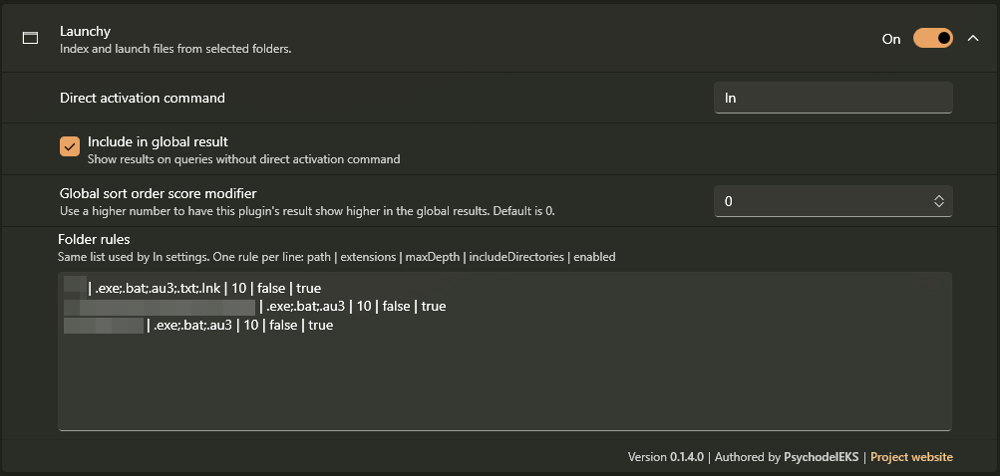
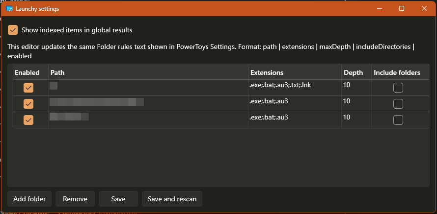

# PowerToys Run Launchy

Launchy-style folder index plugin for PowerToys Run.

Current version: `0.1.11`.

## Features

- Index files from folders you choose.
- Configure extensions, traversal depth, whether folders should be included, and whether parent folder names should match per indexed folder.
- Use `ln <query>` to search indexed entries.
- Use the same PowerToys Run fuzzy matcher as built-in plugins.
- Use `ln settings` to edit folder rules with a table and folder picker.
- Use `ln rescan` to rebuild the index from PowerToys Run.
- Optionally expose indexed entries in global PowerToys Run results.
- Show file and folder icons through the Windows shell icon provider when PowerToys can resolve them.
- Hide files already covered by the built-in PowerToys Run Program/Application plugin from global results, while keeping them available through the `ln` keyword.
- Match parent folder names only for folder rules where `matchDirectoryNames` is enabled. These matches are available in both `ln` and global results.
- Open, reveal, copy, or rescan from the result context menu.

## Screenshots

PowerToys Run plugin settings:



The `ln settings` editor:



## Install with ptr

Install [`ptr`](https://github.com/8LWXpg/ptr), then run:

```powershell
ptr add Launchy PsychodelEKS/PowerToysRun-Launchy
```

To update an existing install:

```powershell
ptr update Launchy
```

## Manual install

1. Download the latest `PowerToysRun-Launchy-*-x64.zip` or `PowerToysRun-Launchy-*-arm64.zip` from the [releases page](https://github.com/PsychodelEKS/PowerToysRun-Launchy/releases).
2. Exit PowerToys completely.
3. Create this folder if it does not exist:

```powershell
$env:LOCALAPPDATA\Microsoft\PowerToys\PowerToys Run\Plugins\Launchy
```

4. Extract the zip contents directly into that folder. `plugin.json` should be at:

```powershell
$env:LOCALAPPDATA\Microsoft\PowerToys\PowerToys Run\Plugins\Launchy\plugin.json
```

5. Start PowerToys again.

## Usage

Use the activation keyword:

```text
ln <query>
```

Control commands are available only through the `ln` keyword:

```text
ln settings
ln rescan
```

`ln settings` opens the table editor for folder rules. `ln rescan` starts a background rebuild and shows a notification when it finishes. If a rescan is already running, a second rescan command is ignored and reports that the rebuild is already in progress.

The command results are also suggested for partial keyword queries. Exact `ln settings` and `ln rescan` matches are ranked first; otherwise the command suggestions are ranked below indexed file results.

Indexed results open with shell execute. The context menu supports:

- Open
- Open containing folder
- Copy path
- Rescan index

## Settings

Open PowerToys Settings, go to PowerToys Run plugins, then open `Launchy`.

Use `Folder rules` to see and edit indexed folders. You can also run `ln settings` in PowerToys Run to edit the same list with a table and folder picker. The GUI editor and the PowerToys multiline field are synchronized.

The text field uses one rule per line:

```text
path | extensions | maxDepth | includeDirectories | enabled | matchDirectoryNames
```

Example:

```text
C:\Tools | .exe;.lnk | 10 | false | true | false
D:\PortableApps | .exe;.bat;.cmd | 2 | true | true | true
```

Fields:

- `path`: folder to index.
- `extensions`: semicolon-, comma-, or space-separated extensions. Default: `.exe;.lnk`.
- `maxDepth`: recursion depth. `0` means only files directly inside `path`; `1` includes one subdirectory level. Default: `10`.
- `includeDirectories`: include discovered subfolders as launchable results. Default: `false`.
- `enabled`: keep the rule active. Default: `true`.
- `matchDirectoryNames`: allow entries from this rule to match parent folder names. Folder-name matches are shown in both `ln` and global results. Default: `false`.

Hidden and system files or folders are skipped.

The plugin stores its own settings and cache outside the installed plugin folder:

```powershell
$env:LOCALAPPDATA\Microsoft\PowerToys\PowerToys Run\Settings\Plugins\Community.PowerToys.Run.Plugin.Launchy\settings.json
$env:LOCALAPPDATA\Microsoft\PowerToys\PowerToys Run\Settings\Plugins\Community.PowerToys.Run.Plugin.Launchy\index.json
```

Use `Save and rescan` in `ln settings`, or run `ln rescan`, to rebuild immediately after changing rules.

## Search Behavior

Keyword search is always available through `ln`. Global results can be enabled with `Include in global result` in PowerToys Settings or `Show indexed items in global results` in `ln settings`.

Ranking prefers exact and prefix matches over substring matches, files over folders for equal scores, and shorter names over longer names. Parent folder name matches are lower-ranked fallback matches and are only available for rules where `matchDirectoryNames` is enabled.

## Build

```powershell
dotnet build .\PowerToysRun-Launchy.sln -c Release -p:Platform=x64
```

The project targets `net10.0-windows` and is built against `Community.PowerToys.Run.Plugin.Dependencies` `0.97.0`.

This plugin was bootstrapped from the [PowerToysRun Plugin Template](https://github.com/8LWXpg/PowerToysRun-PluginTemplate).

## Release

Create and push a version tag:

```powershell
git tag -a vX.Y.Z -m "vX.Y.Z"
git push origin main vX.Y.Z
```

GitHub Actions will publish `x64` and `arm64` zip assets compatible with `ptr`.
